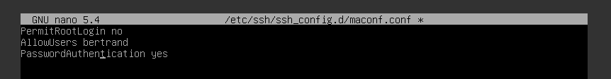
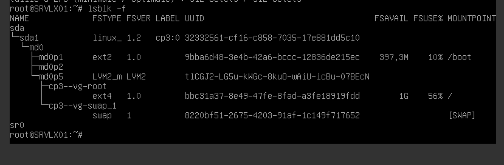
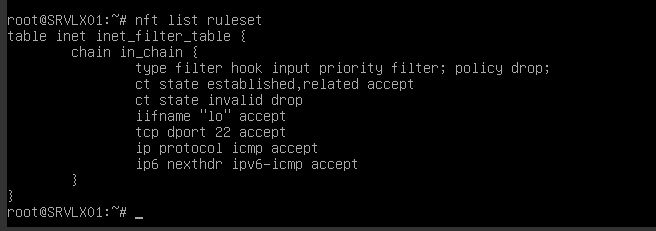
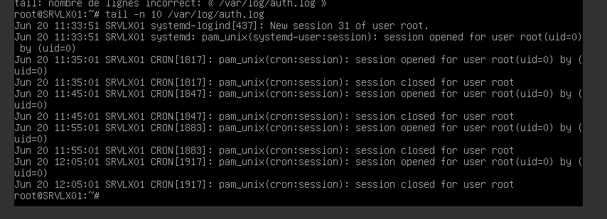

## Partie 1 :Gestion des utilisateurs

### Q.2.1.1 Sur le serveur, créer un compte pour ton usage personnel.

### Q.2.1.2 Quelles préconisations proposes-tu concernant ce compte ?

L'ajouter dans le groupe sudo avec la commande :

         usermode -aG sudo bertrand

## Partie 2 : Configuration de SSH

Un serveur SSH est lancé sur le port par défaut.
Il est possible de s'y connecter avec n'importe quel compte, y compris le compte root.

### Q.2.2.1 Désactiver complètement l'accès à distance de l'utilisateur root.

### Q.2.2.2 Autoriser l'accès à distance à ton compte personnel uniquement.

### Q.2.2.3 Mettre en place une authentification par clé valide et désactiver l'authentification par mot de passe

## Partie 3 : Analyse du stockage

### Q.2.3.1 Quels sont les systèmes de fichiers actuellement montés ?

linux 1,2
ext 2
LVM2_m
EXT4
swap

### Q.2.3.2 Quel type de système de stockage ils utilisent ?
RAID Linux autodétecté
LVM Linux
 (commande fdisk -l)

### Q.2.3.3 Ajouter un nouveau disque de 8,00 Gio au serveur et réparer le volume RAID

### Q.2.3.4 Ajouter un nouveau volume logique LVM de 2 Gio qui servira à héberger des sauvegardes. Ce volume doit être monté automatiquement à chaque démarrage dans l'emplacement par défaut : /var/lib/bareos/storage.

### Q.2.3.5 Combien d'espace disponible reste-t-il dans le groupe de volume ?

## Partie 4 : Sauvegardes

Le logiciel bareos est installé sur le serveur.
Les composants bareos-dir, bareos-sd et bareos-fd sont installés avec une configuration par défaut.

### Q.2.4.1 Expliquer succinctement les rôles respectifs des 3 composants bareos installés sur la VM.

- bareos-dir : il coordonne les opérations de bareos
- bareos-sf : reçoit les données et gère le stockage
- bareos-fd : agent placé sur les clients qui envoi indique au daemon les fichiers à enregistrer

## Partie 5 : Filtrage et analyse réseau

### Q.2.5.1 Quelles sont actuellement les règles appliquées sur Netfilter ?

### Q.2.5.2 Quels types de communications sont autorisées ?

tcp, icmp , ssh (port22)

### Q.2.5.3 Quels types sont interdit ?

Tous les autres (drop)

### Q.2.5.4 Sur nftables, ajouter les règles nécessaires pour autoriser bareos à communiquer avec les clients bareos potentiellement présents sur l'ensemble des machines du réseau local sur lequel se trouve le serveur.

- Rappel : Bareos utilise les ports TCP 9101 à 9103 pour la communication entre ses différents composants.

## Partie 6 : Analyse de logs

### Q.2.6.1 Lister les 10 derniers échecs de connexion ayant eu lieu sur le serveur en indiquant pour chacun :

La date et l'heure de la tentative
L'adresse IP de la machine ayant fait la tentative

